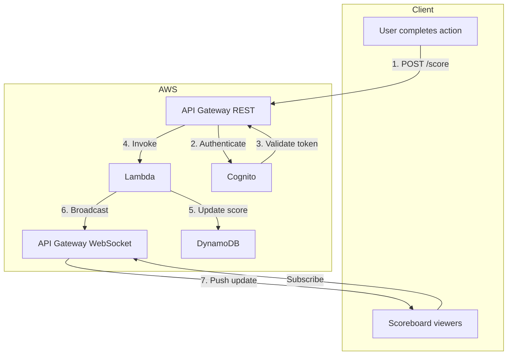
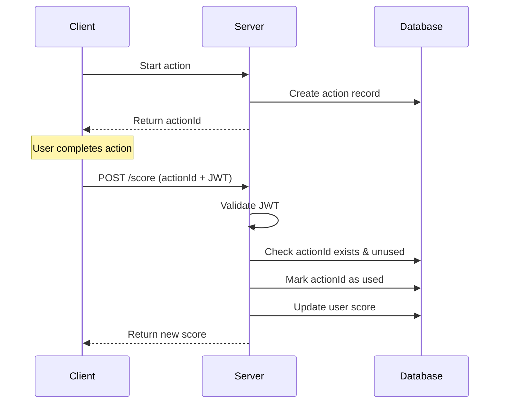
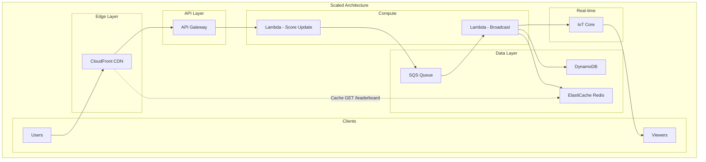

# Live Scoreboard Module

A real-time scoreboard API module that displays the top 10 user scores with live updates.

## Overview

This module provides:
- Real-time leaderboard showing top 10 scores
- Score updates when users complete actions
- Live broadcast to all connected clients
- Security against unauthorized score manipulation

## Architecture



### Flow of Execution

1. **User completes an action** on the website
2. Client sends `POST /api/score` with action details and JWT token
3. API Gateway validates the JWT token via Cognito
4. Lambda function processes the request:
   - Validates the action is legitimate
   - Updates the user's score in DynamoDB
   - Retrieves updated top 10 leaderboard
5. Lambda broadcasts the new leaderboard via WebSocket
6. All connected clients receive the live update

## Technology Stack

| Component | AWS Service | Purpose |
|-----------|-------------|---------|
| REST API | API Gateway | Handle score update requests |
| WebSocket | API Gateway | Real-time broadcasts |
| Business Logic | Lambda | Validate actions, update scores |
| Database | DynamoDB | Store user scores |
| Authentication | Cognito | User identity & JWT tokens |

## API Endpoints

### REST API

#### Update Score

```http
POST /api/score
Authorization: Bearer <jwt_token>
Content-Type: application/json

{
  "actionId": "action-uuid-123",
  "actionType": "completed_task"
}
```

**Response (200 OK):**
```json
{
  "success": true,
  "newScore": 150,
  "rank": 5
}
```

#### Get Leaderboard

```http
GET /api/leaderboard
```

**Response (200 OK):**
```json
{
  "leaderboard": [
    { "rank": 1, "userId": "user-1", "username": "alice", "score": 500 },
    { "rank": 2, "userId": "user-2", "username": "bob", "score": 450 },
    ...
  ],
  "updatedAt": "2024-01-01T12:00:00Z"
}
```

### WebSocket API

#### Connect
```
wss://api.example.com/ws
```

#### Message Format (Server → Client)
```json
{
  "type": "leaderboard_update",
  "data": {
    "leaderboard": [...],
    "updatedAt": "2024-01-01T12:00:00Z"
  }
}
```

## Security Design

### 1. Authentication
- All score updates require a valid JWT token from Cognito
- Token contains user identity - cannot impersonate others

### 2. Action Validation
- Server generates unique `actionId` when user starts an action
- Client must provide valid `actionId` to claim score
- Each `actionId` can only be used once (idempotency)

### 3. Rate Limiting
- API Gateway throttles requests per user
- Prevents rapid-fire score submissions
- Configurable limits (e.g., 10 requests/second)

### 4. Server-Side Score Calculation
- Client only reports action completion
- Server determines score value
- Prevents client-side score manipulation



## Data Model

### DynamoDB Tables

**Users Table**
| Attribute | Type | Description |
|-----------|------|-------------|
| userId (PK) | String | Unique user ID |
| username | String | Display name |
| score | Number | Current total score |
| updatedAt | String | Last score update |

**Actions Table**
| Attribute | Type | Description |
|-----------|------|-------------|
| actionId (PK) | String | Unique action ID |
| userId | String | User who owns this action |
| used | Boolean | Whether score was claimed |
| createdAt | String | When action was created |
| expiresAt | Number | TTL for auto-cleanup |

## Improvement Suggestions

### 1. Caching Layer
Add ElastiCache (Redis) to cache the top 10 leaderboard:
- Reduces DynamoDB reads
- Sub-millisecond response times
- Update cache on score changes

### 2. Anti-Cheat Enhancements
- **Behavioral analysis**: Flag unusual scoring patterns
- **Action timing**: Validate minimum time to complete actions
- **Device fingerprinting**: Detect multi-account abuse

### 3. Horizontal Scaling
- DynamoDB auto-scales by default
- Lambda scales automatically
- For millions of WebSocket connections, consider IoT Core

### 4. Analytics & Monitoring
- CloudWatch dashboards for API metrics
- Alerts for unusual activity spikes
- Score distribution analysis

### 5. Leaderboard Variations
- Daily/weekly/all-time leaderboards
- Regional leaderboards
- Friend-only leaderboards

### 6. Score History
- Store score change history for auditing
- Allow users to view their progression
- Support score rollbacks if cheating detected

## Scaling Strategy

### Current Architecture Limits

| Component | Default Limit | Can Handle |
|-----------|---------------|------------|
| API Gateway | 10,000 req/sec | ~10K concurrent users |
| Lambda | 1,000 concurrent | ~1K simultaneous score updates |
| DynamoDB | On-demand auto-scales | Unlimited reads/writes |
| WebSocket | 500 connections/sec | ~500 new viewers/sec |

### Scaling for High Traffic



### Level 1: 10K-100K Users

**Add caching:**
- ElastiCache (Redis) for leaderboard cache
- CloudFront CDN for GET /leaderboard
- Cache TTL: 1-5 seconds

```
GET /leaderboard → CloudFront → Redis → DynamoDB (cache miss only)
```

### Level 2: 100K-1M Users

**Add message queue:**
- SQS between score update and broadcast
- Prevents Lambda timeout on broadcasts
- Batch WebSocket messages

```
Score Update → SQS → Batch Processor → Broadcast
```

### Level 3: 1M+ Users

**Replace WebSocket with IoT Core:**
- Handles millions of concurrent connections
- Built-in pub/sub with topics
- Users subscribe to `/leaderboard` topic

```
Score Update → IoT Core Publish → All subscribers receive update
```

### DynamoDB Scaling

**For leaderboard queries, add GSI:**

```
Global Secondary Index: score-index
- Partition Key: "LEADERBOARD" (constant)
- Sort Key: score (descending)
- Projection: userId, username, score
```

**Query top 10:**
```
Query score-index WHERE pk = "LEADERBOARD" LIMIT 10 ScanIndexForward=false
```

### Rate Limiting by Tier

| User Tier | Requests/sec | WebSocket Messages/sec |
|-----------|--------------|------------------------|
| Free | 1 | 10 |
| Premium | 10 | 100 |
| Enterprise | 100 | 1000 |

### Scaling Checklist

- [ ] Enable DynamoDB auto-scaling or on-demand
- [ ] Add ElastiCache Redis for leaderboard cache
- [ ] Configure CloudFront for API caching
- [ ] Set up SQS for async broadcast processing
- [ ] Request Lambda concurrency limit increase
- [ ] Migrate to IoT Core if >100K WebSocket connections
- [ ] Add CloudWatch alarms for throttling
- [ ] Enable X-Ray for performance tracing

## Cost Considerations

| Service | Pricing Model | Optimization |
|---------|---------------|--------------|
| API Gateway | Per request | Cache leaderboard GET requests |
| Lambda | Per invocation + duration | Keep functions small |
| DynamoDB | On-demand or provisioned | Use GSI for leaderboard queries |
| WebSocket | Per message + connection time | Batch updates if high frequency |

## Summary

This specification provides a serverless, scalable solution for a real-time scoreboard using AWS managed services. The architecture prioritizes:

- **Security**: JWT auth, server-side validation, rate limiting
- **Scalability**: Serverless components auto-scale
- **Real-time**: WebSocket for instant leaderboard updates
- **Simplicity**: 4 core AWS services, clear data flow
